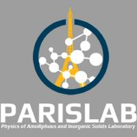

# Onboarding 

Welcome, Parisians!

We are very excited to welcome you to PARISLab. This page is designed to give you the information and tools you need to learn about PARISLab and get familiar with your role. Consider this page a starting point to Learn and Be Curious as you begin to understand your role, your team, and your project. We will update this page on a regular basis to make sure the contents are most up-to-date and you are on the right track of success.    

## Get Started with GitHub

<b>Step 1: Sign up a GitHub account.</b> 
In order to use GitHub and make contributions to your project, a GitHub account is needed beforehand. If you have not done so, please go to: http://github.com/join and follow the instructions to create an account with your .edu account.

<b>(Optional) Step 2: Get Student Benefits and upgrade your account for free.</b> If you satisfy with the free personal account, please stop reading and go to Step 3. With a free personal account, you have unlimited access to public/private repositories and may collaborate with up to 3 co-workers. If you want more advanced options, you may want to upgrade your account to Pro with unstricted access. This can be done for free through [GitHub Student Benefits](https://education.github.com/students). A valid .edu email is needed to apply for the benefits and it may take a few days for your application to be approved.

<b>Step 3: Join PARISLab!</b> When you have a valid GitHub account, please ping Kai Yang or Yuhai Li on Slack or create an issue on this repo, so we can add you to the Team! When you contact us, please provide <b>your name</b>, <b>GitHub username</b>, <b>your project name</b>, <b>team name or the name of your team leader</b>, and <b>link of your code (if applicable)</b>. Thanks.

<b>Step 4: Make a Soft Landing on GitHub.</b> If you have already known GitHub well and are clear about how issues, pull requests and branches work, then feel free to skip this step and enjoy your life in the PARIRLab! Otherwise, please take a few minutes to follow this [GitHub Training Course](https://lab.github.com/githubtraining/introduction-to-github) which is a great icebreaker to help you hit the ground running.

## Get Started with Git
Git is the most widely used control system for code management during software development (it is used in GitHub, of course!). It is beneficial to learn and use Git to manage your project locally and in collaboration with your team. There are a couple of great Git training courses online. [Here](https://try.github.io/) is some learning plans by GitHub, if they do not work to you, feel free to explore more resources online. For Mandrarin Chinese speakers, [this](https://www.lanqiao.cn/courses/1035) is a good tutorial to follow. Enjoy!

## Get Started with Your Project
Please ping Kai Yang or Yuhai Li on Slack or create an issue on this repo regarding the migrating procedure of your project to PARISLab codebase. Depending on if you have deployed your project on GitHub and the code quality, we may decide to directly import your existing project here or create a new repository.

# ML_Resources
Our vision is to give everyone the chance to get involved in this field and get self-motivated as a practitioner. Please keep in mind, machine learning is a practical subject. So, the best way to be an expert is to <b>get your hands dirty</b> and actively solve real-world problems.    

The following is the list of our recommended books. These books are used for internal training only, please do not share them anywhere else. 
* [Machine Learning](ML_resource/README.md#Machine-Learning)
* [Deep Learning](ML_resource/README.md#Deep-Learning)

# MD_bootcamp
The overall goal of this project is to provide an easy and quick experience about how to run Molecular Dynamics (MD) simulations with [LAMMPS](https://lammps.sandia.gov/) package on [Hoffman2 Cluster](https://www.hoffman2.idre.ucla.edu/About/Mission-and-governance.html) (@UCLA).   

This project contains basic tutorials about Hoffman2 Cluster (from creating an account to sbumitting jobs) and MD simulation (from theoretical knowledge to LAMMPS scripts). We also include some example sets for you to practice.

 We hope you will have a fruitful experice on MD.

# Contact
* Webside: http://www.lab-paris.com/    
* Slack: [parislab.slack.com](https://parislab.slack.com)
